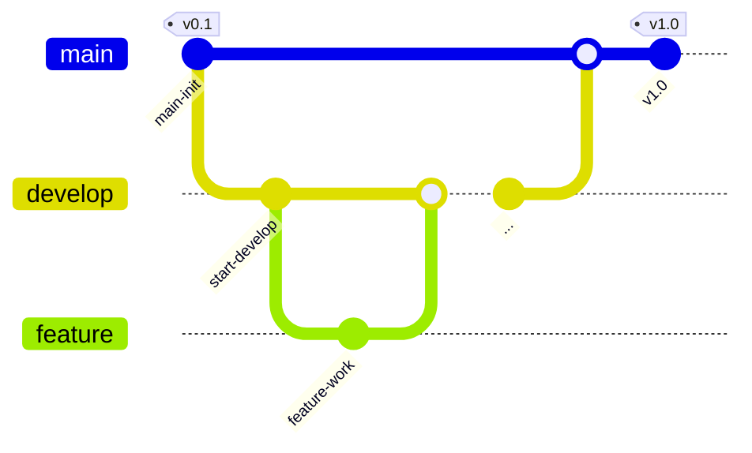

# 킥고-iOS

## 프로젝트 소개


<br>

**프로젝트 주제**: 데이터 CRUD 및 API를 활용해서 킥보드 예약 앱 만들기

**프로젝트 이름**: 킥고(KickGo)

**와이어프레임**: 🔗 [피그마](https://www.figma.com/design/xCA3GkifSvVhWwTorXh14r/%ED%82%A5%EA%B3%A0-%ED%94%BC%EA%B7%B8%EB%A7%88-%EB%B3%B4%EB%93%9C?node-id=142-112&t=wIyQCPsOBnOoV6kg-1)

## 🍎 킥고-iOS Team

<br>
<div align="center">

| 신서연   | 이정은       | 장우석      |
|-------------|--------------|-------------|
| <div align="center">[@hemssy](https://github.com/hemssy)</div>  | <div align="center">[@zzaeun](https://github.com/zzaeun)</div> | <div align="center">[@oww10](https://github.com/oww10)</div> |

</div>
<br>

---
## 📱구동화면


---

## 🛠 Development Environment 

&nbsp;&nbsp;&nbsp;&nbsp;&nbsp;&nbsp;


## 📦 Package Dependencies
[](https://github.com/SnapKit/SnapKit)&nbsp;&nbsp;&nbsp;
[](https://github.com/navermaps/NMaps-iOS)&nbsp;&nbsp;&nbsp;
[](https://github.com/navermaps/NMaps-iOS)

<br>

## 📖 Coding Convention

1. 런타임 크래시를 방지하기 위해 강제 언래핑을 사용하지 않는다.
2. 이중 반복문 사용 등 코드가 복잡해지면 주석이나 PR에 설명을 상세하게 써놓는다.
3. 코드에 이모티콘을 추가하지 않는다.

<br>

## 🙌 Git Convention

### Git-flow 전략



<br>

1. 작업할 내용에 대해서 이슈를 생성하고 이슈번호를 확인한다.
2. 나의 로컬에서 develop 브랜치가 최신화 되어있는지 확인한다.
3. develop 브랜치에서 새로운 이슈 브랜치를 생성한다.
    
     커밋타입/#이슈번호
     ex) feat/#1
    
4. 생성한 브랜치에서 작업을 시작한다.
5. 작업 완료 후, 에러가 없는지 확인하고 커밋 컨벤션에 맞춰 커밋한 후 push 한다.
6. PR을 작성한다.
7. 코드리뷰 후 수정사항 반영한 뒤, develop 브랜치에 merge 한다.
8. 머지 이후, 작업했던 브랜치는 삭제한다.

<br>

### 커밋타입
> `Feat`: 새로운 기능을 추가할 경우  
>
> 
> `Fix`: 버그를 고친 경우  
>
> 
> `Design`: CSS 등 사용자 UI 디자인 변경  
>
> 
> `Style`: 코드 포맷 변경, 세미 콜론 누락, 코드 수정이 없는 경우  
>
> 
> `Refactor`: 프로덕션 코드 리팩토링  
>
> 
> `Docs`: 문서를 수정한 경우  
>
> 
> `Test`: 테스트 추가, 테스트 리팩토링(프로덕션 코드 변경 X)  
>
> 
> `Chore`: gitignore 파일정리, 빌드 테스트 업데이트, 패키지 매니저를 설정하는 경우(프로덕션 코드 변경 X)  
>
> 
> `Rename`: 파일 혹은 폴더명을 수정하거나 옮기는 작업만인 경우  
>
> 
> `Remove`: 파일을 삭제하는 작업만 수행한 경우  

<br>

### Issue & PR title


**이슈 제목**: `[커밋타입] 작업 이름`

**PR 제목**: `[커밋타입] #이슈번호 - 작업 이름`

<br>

### Commit Message


커밋 메시지는 `[커밋타입] #이슈번호 - 작업 이름` 으로 적는다.

**충돌 해결 merge 시**: `[Merge] develop->브랜치이름 머지`

**PR을 develop에 merge 시** : `[Merge] 브랜치이름->develop 머지`

<br>

## 📂 Foldering
```bash
📦 KickGo
├── 🔧 APIKey
└── 📂 KickGo
    ├── 📂 Cell
    │   ├── RegisterCheckCell.swift
    │   └── ScooterCell.swift
    │
    ├── 📂 Controller
    │   ├── LoginViewController.swift
    │   ├── MainViewController.swift
    │   ├── MapCurrentLocation.swift
    │   ├── MapViewController.swift
    │   ├── MarkerSheetViewController.swift
    │   ├── MyRegisterListViewController.swift
    │   ├── MyViewController.swift
    │   ├── RegisterViewController.swift
    │   ├── RentalHistoryViewController.swift
    │   ├── RentViewController.swift
    │   ├── SignUpViewController.swift
    │   └── SplashViewController.swift
    │
    ├── 📂 Delegate
    │   ├── AppDelegate.swift
    │   └── SceneDelegate.swift
    │
    ├── 📂 Model
    │   ├── 📂 AdressAPI
    │   │   └── AddressModel.swift
    │   ├── const.swift
    │   ├── CoreDataStack.swift
    │   └── KickGoModel.xcdatamodeld
    │
    ├── 📂 Resources
    │   ├── 📁 Assets.xcassets
    │   └── LaunchScreen.storyboard
    │
    ├── 📂 Utils
    │   ├── Color.swift
    │   ├── CreateAlertProtocol.swift
    │   ├── Error.swift
    │   ├── HideKeyboardTappedAround.swift
    │   ├── MapMarkerManager.swift
    │   └── ValidSignUp.swift
    │
    ├── 📂 Views
    │   ├── MapView.swift
    │   ├── RegisterCheck.swift
    │   ├── RegisterLocateSetting.swift
    │   └── RegisterView.swift
    │
    └── 📄 Info.plist

📦 Package Dependencies
├── 📦 NMapsGeometry 1.0.2
└── 📦 NMapsMap 3.23.0
└── 📦 SnapKit 5.7.1

